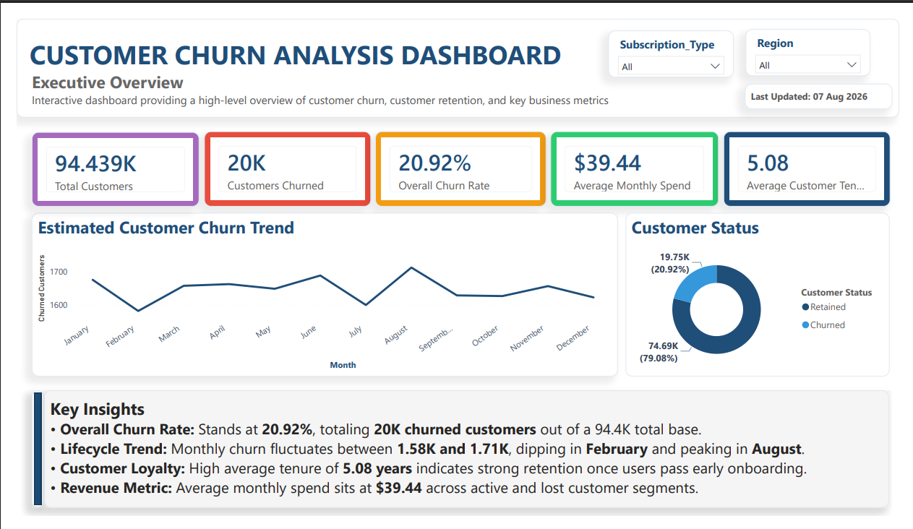
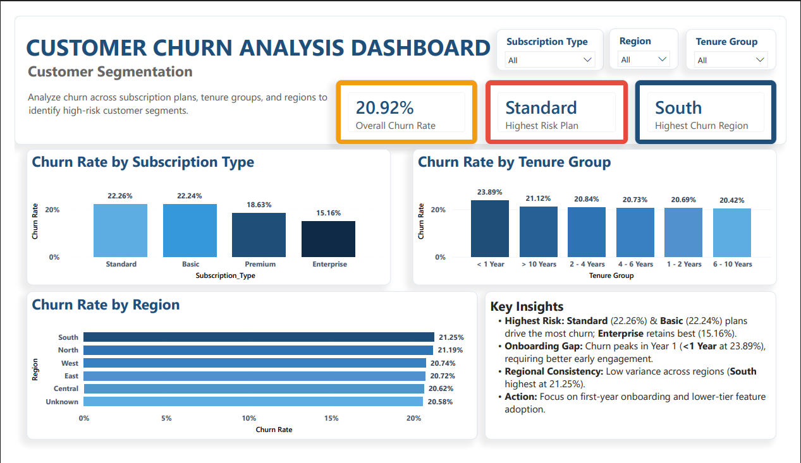
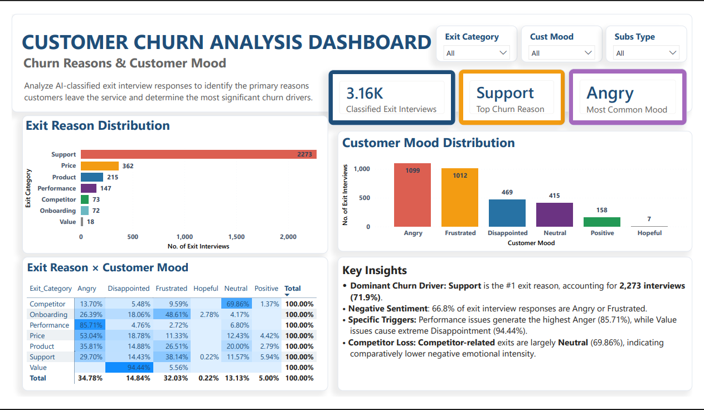

# SaaS Customer Churn Analysis

## 📊 Project Overview

An end-to-end data analytics project focused on understanding **why SaaS customers churn, which customer segments are most at risk, and how departing customers feel about their experience**.

The project combines structured customer data with unstructured exit interview feedback to move from **raw data → data cleaning → exploratory analysis → customer sentiment analysis → dashboarding → business recommendations**.

The analysis covers **95K+ customer records and 3K+ exit interview responses**, using Python for data cleaning and exploratory analysis, AI-assisted NLP for exit-reason and mood classification, and Power BI for interactive business reporting.

---

## 🎯 Business Problem

The SaaS company has observed an increasing customer churn rate and wants to understand:

- Which customer segments have the highest churn risk?
- What are the primary reasons customers leave?
- What patterns exist across tenure, subscription type, region, spending, and support activity?
- What emotions are associated with customer exits?
- What actions can management take to improve customer retention?

---

## 🔎 Project Objectives

- Clean and validate structured and unstructured customer data
- Identify key patterns and drivers of customer churn
- Analyze churn across different customer segments
- Classify exit interviews into meaningful churn-reason categories
- Analyze customer mood and sentiment patterns
- Examine the relationship between exit reasons and customer mood
- Build an interactive Power BI dashboard
- Translate analytical findings into practical business recommendations

---

## 🛠️ Tools & Technologies

- **Python**
- **Pandas**
- **NumPy**
- **Regular Expressions**
- **Google Colab**
- **AI-assisted NLP**
- **Power BI**
- **Data Visualization**

---

## 📁 Dataset

The project uses two datasets:

### 1. Customer Dataset

Approximately **95K customer records** containing information related to:

- Customer demographics
- Subscription type
- Customer tenure
- Monthly spending
- Support tickets
- Churn status

### 2. Exit Interview Dataset

Approximately **3.5K customer exit interview responses** containing unstructured feedback about why customers left the service.

> **Note:** The original datasets are not included in this repository because they were provided as part of a course project and are not publicly redistributed.

---

## 🧹 Data Cleaning

The data cleaning process addressed several real-world data-quality issues.

### Structured Data

- Removed duplicate records
- Handled missing values
- Standardized inconsistent categorical labels
- Corrected invalid numeric values
- Standardized date formats
- Handled currency and encoding issues
- Validated churn-related fields
- Identified invalid ages and negative values

### Unstructured Text Data

- Removed HTML tags and formatting artifacts
- Cleaned irregular whitespace and tab characters
- Handled null-like placeholders
- Cleaned corrupted text/encoding issues
- Removed low-information responses
- Standardized text for downstream classification

The cleaned datasets were then prepared for exploratory analysis and exit-interview classification.

---

## 📈 Exploratory Data Analysis

Customer churn was analyzed across the following dimensions:

- **Subscription Type**
- **Customer Tenure**
- **Geographic Region**
- **Monthly Spending**
- **Support-Ticket Activity**

The analysis focused on identifying high-risk customer segments and operational patterns associated with churn.

---

## 💬 Exit Reason Classification

Exit interview responses were classified into seven churn-reason categories:

1. **Support**
2. **Price**
3. **Product**
4. **Performance**
5. **Onboarding**
6. **Competitor**
7. **Value**

AI-assisted classification was used to transform unstructured customer feedback into structured analytical categories.

---

## 😊 Customer Mood Analysis

Customer exit interviews were also classified into six mood categories:

- **Angry**
- **Frustrated**
- **Disappointed**
- **Neutral**
- **Positive**
- **Hopeful**

The analysis examined both the overall mood distribution and the relationship between **exit reasons and customer mood**.

---

## 📊 Power BI Dashboard

The final Power BI dashboard consists of three analytical pages.

### 1. Overview

Provides a high-level view of customer churn, including key churn KPIs and overall trends.

### 2. Customer Segmentation

Analyzes churn across:

- Subscription type
- Tenure group
- Region

The dashboard highlights the highest-risk customer segments.

### 3. Churn Reasons & Customer Mood

Combines:

- Exit-reason distribution
- Customer mood distribution
- Reason × Mood analysis

This page helps connect the operational reasons for churn with the emotional state of departing customers.

---

## 🖼️ Dashboard Preview

### Overview



### Customer Segmentation



### Churn Reasons & Customer Mood



---

## 💡 Key Findings

### Overall Churn

The overall customer churn rate was approximately **20.92%**.

### Subscription Type

**Basic customers** showed the highest churn rate at approximately **22.26%**, while Enterprise customers showed substantially lower churn.

### Customer Tenure

Customers with **less than one year of tenure** showed the highest churn rate at approximately **23.89%**, highlighting the importance of early customer engagement.

### Region

Churn rates were relatively consistent across regions, indicating limited geographic variation compared with other customer characteristics.

### Exit Reasons

**Support** was the dominant classified exit reason, accounting for approximately **71.9%** of exit interviews.

### Customer Mood

Approximately **81.6%** of departing customers expressed negative moods, defined as:

- Angry
- Frustrated
- Disappointed

### Support Activity

Churn increased substantially among customers with higher support-ticket activity, making support interactions an important potential early-warning signal.

---

## 🚀 Business Recommendations

Based on the analysis, three priority actions were identified.

### 1. Strengthen Customer Support

Improve support response times, escalate repeated unresolved issues, and proactively address customers with high support activity.

**Goal:** Reduce support-related customer churn.

---

### 2. Improve First-Year Onboarding

Introduce a structured onboarding journey and proactive engagement programs for customers during their first year.

**Goal:** Reduce early-stage customer churn.

---

### 3. Build an Early-Warning Churn System

Use signals such as:

- Support-ticket activity
- Customer tenure
- Subscription type
- Customer behavior

to identify high-risk customers before they churn.

**Goal:** Enable proactive retention interventions instead of reacting after customers leave.

---

## 📂 Repository Structure

```text
saas-customer-churn-analysis/
│
├── README.md
│
├── notebooks/
│   └── SaaS_churn_analysis.ipynb
│
├── dashboards/
│   ├── SaaS_Churn_Dashboard.pbix
│   ├── overview.png
│   ├── segmentation.png
│   └── churn_reasons_mood.png
│
└── presentation/
    └── SaaS_Churn_Analysis.pdf
